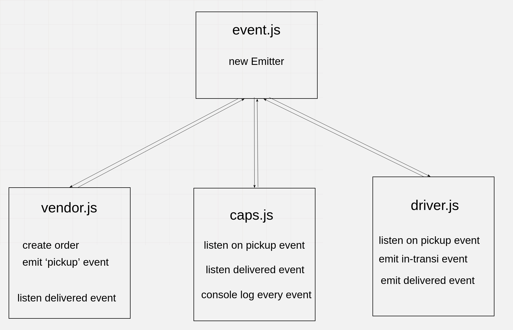

# caps

## Author: Wesam Al-Masri

The Code Academy Parcel Service (CAPS): A system that emulates a real world supply chain.

The app simulate a delivery service where vendors (such a flower shops) will ship products using our delivery service and when our drivers deliver them, be notified that their customers received what they purchased.

- [Submission Pull Request](https://github.com/401-js-WesamAlmasri/caps/pull/1)
- [Tests](https://github.com/401-js-WesamAlmasri/caps/actions/)

## Setup

`.env Requierments`

- `STORE_NAME` - name of the store

## Running the app

1. Clone the repo.
2. Install dependencies `npm install`
3. Run the app `npm start`

## Testing

To run tests run the command `npm test`

## UML

